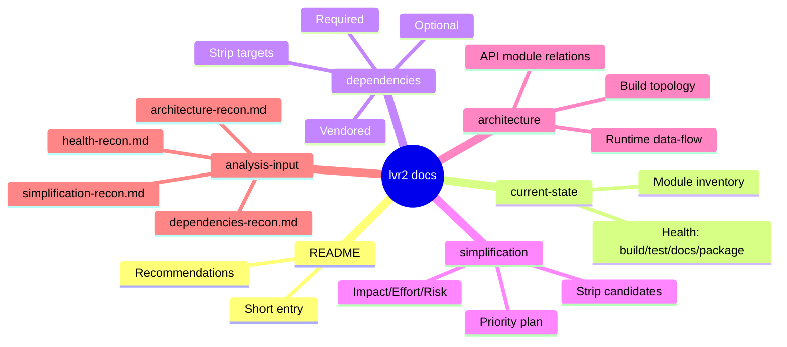

# LVR2 Analysis Docs

Status-oriented map for a no-code analysis pass across build, dependencies, simplification, and architecture.

## Short entry
- **Project**: `lvr2` (version 25.2.3) is a C++17 point-cloud reconstruction toolkit with a shared library plus many tool/front-end targets.
- **Scope assessed**: build graph, dependency surface, public API modules, and health signals from repo and workflows.
- **Source of truth used**: `CMakeLists.txt` build wiring, `src/liblvr2/CMakeLists.txt`, tool `CMakeLists.txt` files, packaging configs, CI workflows, and focused recon notes in `docs/analysis-input/*.md`.

## Document map
- `docs/current-state.md` — module inventory + health check (build/test/docs/package).
- `docs/dependencies.md` — required / optional / vendored dependency matrix + strip candidates.
- `docs/simplification.md` — prioritized strip/cleanup plan with impact/effort/risk.
- `docs/architecture.md` — execution/data-flow + module wiring with file anchors.

## Current state (compact)
- **Build config**: `CMakeLists.txt:5-15` enables library + core tools by default; examples/viewer default OFF.
- **Dependency policy**: broad required set + broad optional gates; many optional features are still effectively always initialized by defaults (`LVR2_WITH_CUDA=ON`, `LVR2_WITH_OPENCL=ON`).
- **Tool surface**: `src/tools/*` has 34 tool dirs; only a subset is active by default.
- **Tests/CI**: no first-party `ctest` flow in build scripts.
- **Packaging/docs**: metadata drift between CMake, `package.xml`, legacy Debian files, and README dependency snippets.

## Top recommendations
1. **Normalize feature flags** (`LVR2_WITH_*` end-to-end) and remove old `WITH_*` references before build simplification.
2. **Split optional surfaces** (viewer/GPU/3DTiles/legacy tools) from the default headless product.
3. **Align package + docs + CI dependency contracts** to prevent install drift.
4. **Prune proven-dead modules** (orphaned/ commented tools + dormant vendor subtrees) after ownership review.
5. **Add at least one health gate** (`ctest`, docs smoke checks, release artifact checks) in CI.

## Mermaid: quick document map

## Deep references
- Raw findings: `docs/analysis-input/architecture-recon.md`, `docs/analysis-input/dependencies-recon.md`, `docs/analysis-input/health-recon.md`, `docs/analysis-input/simplification-recon.md`.
- Product build/install baseline: `CMakeLists.txt`, `src/liblvr2/CMakeLists.txt`, `CMakeModules/lvr2-packaging.cmake`, `CMakeModules/lvr2-config.cmake.in`, `.github/workflows/*.yml`.
