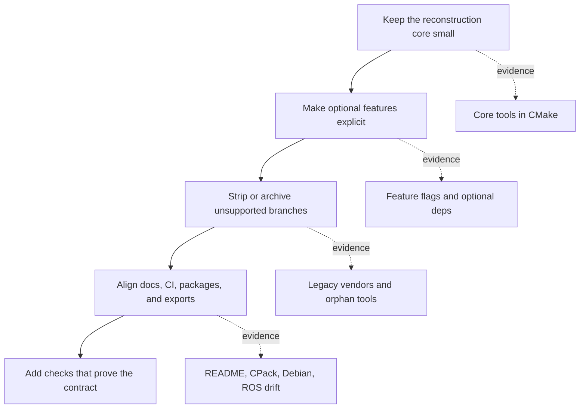

# LVR2 Repository Analysis

> [!IMPORTANT]
> **Common thread:** make LVR2 a small, reliable, headless reconstruction core.
> Keep GPU, viewer, 3D Tiles, legacy IO, and old packaging as explicit opt-in
> feature packs or archive them when they are not maintained.

## Read by intent

| If you want to... | Start here | You get |
|---|---|---|
| Understand the repo shape | [Current state](current-state.md) | Product surface, health pulse, and drift map |
| Find dependency risk | [Dependencies](dependencies.md) | Required/optional/vendored dependency contract |
| Plan cleanup work | [Simplification plan](simplification.md) | Ordered PR stack with strip candidates |
| Follow runtime/build flow | [Architecture](architecture.md) | Reconstruction pipeline and build seams |
| Audit raw evidence | [`analysis-input/`](analysis-input/) | Dense recon notes from subagent passes |

## The analysis thread

Use the diagram as the through-line for the rest of the docs: every finding is
about shrinking hidden default surface area or proving that a retained surface is
maintained.

## Findings at a glance

| Area | Current signal | Why it matters | Deep dive |
|---|---|---|---|
| Default surface | Tools are on, examples/viewer are off, CUDA/OpenCL default on in [root options](../CMakeLists.txt#L5-L15). | The default build is not a minimal headless build yet. | [Current state](current-state.md#product-surface) |
| Dependency contract | Required deps and exported deps are broad; optional deps leak into default reasoning. | Install and downstream `find_package(lvr2)` behavior can drift. | [Dependencies](dependencies.md#contract-risks) |
| Tool sprawl | Only three default tools are enabled in [tool wiring](../CMakeLists.txt#L767-L811), but many experimental/commented/orphan dirs remain. | Unsupported tools add review, package, and docs cost. | [Simplification](simplification.md#strip-candidates) |
| Health checks | Main CI builds but does not run first-party CTest. | Compile success can hide runtime or packaging regressions. | [Current state](current-state.md#health-pulse) |
| Packaging/docs | CPack, `debian/`, `package.xml`, README, and workflows are not one contract. | Users and downstream packagers see contradictory requirements. | [Dependencies](dependencies.md#metadata-drift) |

## First PR stack

- [ ] Normalize feature flags to `LVR2_WITH_*` and deprecate old `WITH_*` names.
- [ ] Flip CUDA/OpenCL to explicit opt-in or document why they remain default-on.
- [ ] Add a minimal CI smoke/CTest gate for the default build.
- [ ] Archive or remove dead branches: KinFu, Freenect, commented/orphan tools, stale local scripts.
- [ ] Pick one packaging source of truth and link README dependency docs to it.

## Evidence appendix

Raw recon files

- [Architecture recon](analysis-input/architecture-recon.md)
- [Dependency recon](analysis-input/dependencies-recon.md)
- [Health recon](analysis-input/health-recon.md)
- [Simplification recon](analysis-input/simplification-recon.md)

These appendices are intentionally denser than the main docs. Use them when you
need exact observations behind a recommendation.

