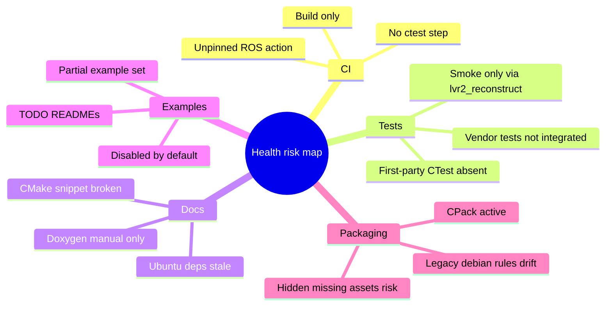

# Repo Health Recon

Scope: CI, tests, docs, examples, build/package state. Static-only; no build tree existed (`build/` absent), so no configure/build/ctest run.

## Snapshot

- Project version aligned across CMake/package/changelog: `CMakeLists.txt:2`, `package.xml:4`, `CHANGELOG.rst:5`.
- Default build is library + core tools; examples/viewer off by default: `CMakeLists.txt:5-7`, `CMakeLists.txt:767-771`.
- CI has CMake build matrix plus ROS smoke workflows: `.github/workflows/cmake-multi-platform-build.yml:28`, `.github/workflows/ros-iron.yml:28-33`.
- Packaging uses CPack TGZ+DEB: `CMakeModules/lvr2-packaging.cmake:35-42`.

## Risks

| Severity | Area | Finding | Evidence | Impact / next step |
|---|---|---|---|---|
| High | Tests/CI | First-party CI builds but does not run CTest or unit tests. Main CMake workflow ends after `cmake --build`; no `ctest` step in workflows. | `.github/workflows/cmake-multi-platform-build.yml:60-72`; workflow grep found no `ctest`; root CMake has no first-party `enable_testing`/`add_test` matches. | Regressions can merge if compile succeeds. Add `enable_testing()`, first-party tests, and CI `ctest --output-on-failure`. |
| High | ROS CI | ROS Iron workflow is likely stale: Iron is EOL, still run on `ubuntu-22.04`; action ref is floating `industrial_ci@master`. | `.github/workflows/ros-iron.yml:19`, `.github/workflows/ros-iron.yml:29-33` (same pin pattern in Humble/Jazzy). | Non-reproducible CI; obsolete distro can break from upstream changes. Pin action SHA/tag; retire or quarantine Iron. |
| Medium | Docs | Ubuntu install docs list stale packages for supported newer Ubuntu: `libvtk7-dev`, `libvtk7-qt-dev`, `qt5-default`. | `README.md:27-40` | Fresh users on 22.04/24.04 likely hit apt failures. Split per Ubuntu version or align with CI package list. |
| Medium | Docs | Downstream CMake snippet has target-name mismatch: executable is `my_own_exec`, link target is `my_app`. | `README.md:331-334` | Copy-paste integration fails. Fix snippet. |
| Medium | Examples | Examples are off by default and incomplete; coordinates/raycasting excluded, multiple README TODOs. | `CMakeLists.txt:5`, `CMakeLists.txt:816-817`; `examples/CMakeLists.txt:1-4`; `examples/scan_projects/loadpartial/README.md:1-7`; `examples/scan_projects/compression/README.md:1-3`; `examples/scan_projects/README.md:27-28` | Examples may rot outside default CI. Add an examples build job (`-DLVR2_BUILD_EXAMPLES=ON`) or mark unsupported examples. |
| Medium | Build deps | Required CMake deps are broader than CI/docs surface and not tested as a minimal install contract. CMake requires TBB/TIFF/GDAL/yaml-cpp; CI apt line omits explicit `libtbb-dev` and `libtiff-dev` while CPack declares them. | `CMakeLists.txt:134-148`, `CMakeLists.txt:518`; `.github/workflows/cmake-multi-platform-build.yml:49-51`; `CMakeModules/lvr2-packaging.cmake:44-60` | CI may rely on transitive apt deps. Make direct CI deps explicit and keep README/package.xml/CPack/debian synchronized. |
| Medium | Packaging | Legacy Debian rules use obsolete option `-DWITH_CUDA=Off`; actual option is `LVR2_WITH_CUDA`. | `debian/rules:22-27`; `CMakeLists.txt:11` | Non-CUDA deb build may still probe CUDA because option name is ignored. Update or retire legacy `debian/` path. |
| Low | Build tech debt | CMake intentionally keeps old policies/obsolete FindCUDA path. | `CMakeLists.txt:49-60` | Future CMake updates can warn or fail. Track cleanup before bumping minimum CMake. |
| Low | Docs | Doxygen target is manual only; CI does not install Doxygen/GraphViz or build docs. | `README.md:311-316`; `CMakeLists.txt:918-935` | API docs can silently break. Add optional docs CI or periodic job. |
| Low | Release | Release workflow copies package artifacts with `|| true`, hiding missing `.tar.gz`/`.deb` before upload. | `.github/workflows/build-and-attach-release-assets.yml:70-86` | Broken packages may become a late upload failure or partial release. Fail fast if expected artifacts absent. |

## Stale / broken clues

- `README.md:27-40`: single Ubuntu dependency block spans 18.04 through 24.04 but includes removed legacy packages.
- `README.md:331-334`: CMake example cannot link as written due target mismatch.
- `debian/control:6`, `debian/control:23`, `debian/control:58`: Debian metadata still references VTK6 while README uses VTK7 and CI omits VTK entirely.
- `debian/rules:25`: obsolete `WITH_CUDA` option.
- `examples/*/README.md`: TODO placeholders remain in user-facing example docs.
- `.github/workflows/cmake-multi-platform-build.yml:1-2`: starter-workflow comments still present; clue CI was not fully tailored.

## Suggested order

1. Add first-party smoke/CTest coverage and run it in CI.
2. Pin/refresh ROS workflows; drop Iron if unsupported.
3. Sync dependency docs + CI + package metadata.
4. Add examples build job or mark incomplete examples explicitly.
5. Harden release artifact checks.
