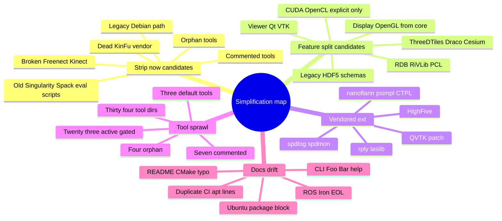

# Simplification Recon

Scope: **no code/config edits**. Static repo audit plus small web checks for Ubuntu package drift and ROS Iron status. No configure/build/ctest run.

## Executive read

- Highest-confidence strip/quarantine: dead KinFu vendor tree, broken Freenect/Kinect path, commented/orphan tools, legacy `debian/` packaging path, old container/local environment scripts.
- Biggest simplification lever: split optional subsystems out of core. Headless default still carries OpenGL/GLUT display code, default GPU probes, unconditional vendored deps, and many schema/tool surfaces.
- Docs/package metadata are not one source of truth. README, CPack, `package.xml`, legacy Debian files, CI, and tool help disagree.

## Inventory snapshot

- Top-level build options are already feature-shaped, but several are unused or drifted: `CMakeLists.txt:5-15`.
- Default build: library plus `lvr2_reconstruct`, `lvr2_mesh_reducer`, `lvr2_hdf5_mesh_tool`: `CMakeLists.txt:767-771`.
- Experimental tools gate holds many more executables and comments out several: `CMakeLists.txt:773-811`.
- Repo has 34 `src/tools/*` dirs, 10 `ext/*` dirs, 15 `CMakeModules/*` files, 5 GitHub workflows. Counted from filesystem.
- Tracked file counts: 1554 total, 476 under `ext/`, 384 under `src/tools/`. Vendored ext breakdown by tracked files: `spdlog` 175, `HighFive` 99, `laslib` 94, `kintinuous` 61, `spdmon` 30, rest small.

## High-confidence strip / quarantine candidates

### 1. `ext/kintinuous` plus `LVR2_WITH_KINFU`

**Why strip:** root option exists, but no root build path consumes it; vendored CMake expects old OpenNI/OpenCV/CUDA/Qt stack and stale LVR target names.

Evidence:

- Option exists: `CMakeLists.txt:9`.
- Root CMake still appends a non-existing KinFu module path: `CMakeLists.txt:84-87`.
- `ext/kintinuous` requires OpenNI2 and OpenCV 2.4.8 `nonfree`: `ext/kintinuous/CMakeLists.txt:4`, `ext/kintinuous/CMakeLists.txt:36`.
- KinFu CMake uses legacy CUDA macros and links stale `lvr_static`: `ext/kintinuous/kfusion/CMakeLists.txt:52`, `ext/kintinuous/kfusion/CMakeLists.txt:67`.
- Qt app uses Qt4 and stale targets: `ext/kintinuous/qt_app/CMakeLists.txt:56`, `ext/kintinuous/qt_app/CMakeLists.txt:91`.
- README inside vendor names 2014-era deps: `ext/kintinuous/README.md:18-29`.

Suggested simplification: remove/quarantine `ext/kintinuous`, remove `LVR2_WITH_KINFU`, remove KinFu module-path entry, and stop installing OpenNI find modules unless another supported feature needs them.

### 2. Freenect / Kinect subsystem

**Why strip:** option and source gate use different variable names; source includes headers that are only under `deprecated/`; one deprecated header has a malformed Boost include.

Evidence:

- User-facing option is `LVR2_WITH_FREENECT`: `CMakeLists.txt:14`.
- Dependency probe checks `LVR2_WITH_FREENECT`: `CMakeLists.txt:471-477`.
- Source list checks stale `WITH_FREENECT`: `src/liblvr2/CMakeLists.txt:130-133`.
- Source includes missing public paths: `src/liblvr2/io/KinectIO.cpp:35`, `src/liblvr2/io/KinectGrabber.cpp:39`.
- Actual headers are under `include/lvr2/io/deprecated/`; malformed include at `include/lvr2/io/deprecated/KinectGrabber.hpp:41`.

Suggested simplification: remove Freenect/Kinect option, probe, sources, deprecated headers, and docs unless someone confirms active hardware support.

### 3. Commented and orphan tool directories

**Why strip:** tool tree is much larger than default product surface; several dirs are commented out or not referenced by root CMake.

Evidence:

- Default tools are only three: `CMakeLists.txt:767-771`.
- Experimental gate includes many tools and comments out others: `CMakeLists.txt:773-811`.
- Commented-out dirs from root CMake: `lvr2_hdf5_convert_old`, `lvr2_hdf5togeotiff`, `lvr2_largescale_reconstruct`, `lvr2_registration`, `lvr2_riegl_project_converter`, `lvr2_slam2hdf5`, `teaser_example`. See root comments at `CMakeLists.txt:764`, `CMakeLists.txt:784-795`, `CMakeLists.txt:798`.
- Orphan dirs not referenced by root CMake: `lvr2_fastsense_reconstruction`, `lvr2_hdf5_builder`, `lvr2_hdf5_builder_2`, `lvr2_largescale_reconstruct_mpi`.
- Some tool CMake files show unfinished or broken install state: `src/tools/lvr2_ascii_viewer/CMakeLists.txt:28`, `src/tools/lvr2_cuda_normals/CMakeLists.txt:24`, `src/tools/lvr2_riegl_project_converter/CMakeLists.txt:7`.
- Experimental tools link unconfigured deps such as `Boost_LOG_LIBRARY_RELEASE`: `src/tools/lvr2_dmc_reconstruction/CMakeLists.txt:26`, `src/tools/lvr2_gs_reconstruction/CMakeLists.txt:26`, while root Boost components do not include log: `CMakeLists.txt:203-217`.

Suggested simplification: define a supported tool set. Move unsupported/commented/orphan tools to an attic or delete after owner sign-off. Split experimental tools into named feature groups instead of one broad `LVR2_BUILD_TOOLS_EXPERIMENTAL`.

### 4. Legacy Debian package path

**Why strip or choose one packaging path:** CPack is active now, while `debian/` still reflects old Ubuntu/Bionic-era packaging and obsolete option names.

Evidence:

- CPack TGZ and DEB packaging is active: `CMakeModules/lvr2-packaging.cmake:36-42`, included at `CMakeLists.txt:939`.
- Legacy Debian metadata uses VTK6 and mandatory CUDA toolkit: `debian/control:4-11`, `debian/control:23-27`, `debian/control:58-63`.
- Debian rules pass obsolete `-DWITH_CUDA=Off`; current option is `LVR2_WITH_CUDA`: `debian/rules:22-27`, `CMakeLists.txt:11`.
- Debian install snippets expect `usr/share/HighFive/*`: `debian/liblvr2-dev.install:4`, `debian/liblvr2-cuda-dev.install:4`; current CMake installs HighFive headers under include: `CMakeLists.txt:893-895`.
- `debian/changelog` is still 2019 Bionic packaging history: `debian/changelog:1-24`.

Suggested simplification: make CPack the only in-repo package path, or regenerate `debian/` from CPack/source. Do not keep both unsynchronized.

### 5. Old container/local scripts

**Why strip:** they encode stale package names, hardcoded local paths, and one-off benchmarks.

Evidence:

- `Singularity.def` targets Ubuntu focal, installs `libvtk7-*` and `qt5-default`, disables SSL verification, clones old GitLab `Develop.git`: `Singularity.def:2`, `Singularity.def:13`, `Singularity.def:15`, `Singularity.def:28`.
- `spack_modules.bash` hardcodes site-local `/appl/spack/...` paths: `spack_modules.bash:18`.
- `eval.sh` is a hyperspectral chunk-size experiment against `~/tmp/hyperspectral` and writes local result files: `eval.sh:5-15`.

Suggested simplification: delete or move to `docs/archive/unsupported/` with explicit non-maintained status.

## Feature split / simplify candidates

### 6. Display/OpenGL in core library

**Why simplify:** viewer is off by default, but core still compiles display sources and public headers expose GL/GLUT. This keeps headless builds tied to graphics deps.

Evidence:

- Root CMake searches OpenGL and GLUT before tool/viewer gates: `CMakeLists.txt:234-258`.
- Core source list always includes display units: `src/liblvr2/CMakeLists.txt:27-40`.
- Public headers include GL/GLUT: `include/lvr2/display/Renderable.hpp:45-49`, `include/lvr2/display/StaticMesh.hpp:52-57`, `include/lvr2/algorithm/Tesselator.hpp:44-49`.

Suggested simplification: split `lvr2display` or `LVR2_WITH_DISPLAY`. Keep headless `lvr2core` free of OpenGL/GLUT and move display/viewer-only headers behind that feature.

### 7. CUDA/OpenCL defaults and legacy CUDA path

**Why simplify:** GPU probes are on by default and can add extra targets or fatal paths if present. GPU should be explicit.

Evidence:

- CUDA and OpenCL default to ON: `CMakeLists.txt:11-12`.
- CMake keeps old policies for obsolete `FindCUDA`: `CMakeLists.txt:58-60`.
- CUDA detection falls back from `CUDAToolkit` to legacy `find_package(CUDA)`: `CMakeLists.txt:305-328`.
- CUDA library build requires NVRTC and builds static plus shared targets: `src/liblvr2/CMakeLists.txt:308-379`; fatal on missing NVRTC at `src/liblvr2/CMakeLists.txt:351-353`.
- OpenCL wrapper falls back to CUDA OpenCL paths and has stale catkin wording: `CMakeModules/FindOpenCL2.cmake:1-28`.

Suggested simplification: default both OFF. Add explicit `LVR2_WITH_CUDA=ON` and `LVR2_WITH_OPENCL=ON` feature builds in CI if supported. Remove legacy FindCUDA path when minimum CMake/toolkit policy allows.

### 8. 3D Tiles / Draco / Cesium path

**Why simplify:** feature is off by default but current wiring is inconsistent and includes a network build path.

Evidence:

- Option exists: `CMakeLists.txt:10`.
- Enabling 3D Tiles downloads Cesium Native via `ExternalProject_Add`: `CMakeLists.txt:540-571`.
- Libraries are set in `3DTILES_LIBRARIES`, but link append checks `3DTILES_FOUND`, which is not set nearby: `CMakeLists.txt:571`, `CMakeLists.txt:749-751`.
- Core and tool use stale `WITH_3DTILES`: `src/liblvr2/CMakeLists.txt:157`, `src/liblvr2/CMakeLists.txt:209`, `src/tools/lvr2_3dtiles/CMakeLists.txt:1-3`.
- Tool is included under experimental regardless, then creates an error target if `WITH_3DTILES` is absent: `CMakeLists.txt:794`, `src/tools/lvr2_3dtiles/CMakeLists.txt:1-4`.

Suggested simplification: quarantine until flag names are unified. If kept, require explicit system/pinned dependency path and no implicit network fetch in normal configure/build.

### 9. Legacy HDF5 and schema surface

**Why simplify:** public headers and CLI advertise schemas that are not fully compiled or implemented; deprecated HDF5 code is still used by public APIs and tools.

Evidence:

- Public `ChunkIO` includes deprecated HDF5 feature headers: `include/lvr2/io/ChunkIO.hpp:41-45`.
- `ChunkHashGrid` also includes deprecated HDF5: `include/lvr2/algorithm/ChunkHashGrid.hpp:40-41`.
- Default `lvr2_hdf5_mesh_tool` uses deprecated HDF5 feature IO: `src/tools/lvr2_hdf5_mesh_tool/HDF5MeshTool.cpp:49-50`.
- `lvr2_hdf5_convert_old` exists but is commented out in root CMake: `src/tools/lvr2_hdf5_convert_old/CMakeLists.txt:5-33`, `CMakeLists.txt:792`.
- Reconstruct CLI advertises `HDF5V2`, `HYPERLIB`, and `RAWPLY`: `src/tools/lvr2_reconstruct/Options.cpp:66`.
- Schema factory includes HDF5V2/Hyperlib headers but maps `HYPERLIB` to Raw and has a typo `HDFV5V2` that returns null: `src/liblvr2/util/ScanProjectSchemaUtils.cpp:5-9`, `src/liblvr2/util/ScanProjectSchemaUtils.cpp:36-45`, `src/liblvr2/util/ScanProjectSchemaUtils.cpp:84-90`.
- CMake source list comments out Hyperlib/legacy schema sources: `src/liblvr2/CMakeLists.txt:70-77`.

Suggested simplification: pick supported schemas and remove stale names from CLI/docs. Move deprecated HDF5 feature IO behind a compatibility option or remove after migration path is documented.

### 10. Vendored `ext/` policy

**Why simplify:** several vendored libs are unconditionally included or manually installed. Some carry separate license/maintenance load.

Evidence:

- Unconditional vendored add_subdirs: spdlog, spdmon, nanoflann, psimpl, rply, laslib, CTPL at `CMakeLists.txt:484-523`.
- HighFive is manually included, not added as a subdir, because add_subdirectory is documented as crashing: `CMakeLists.txt:513-515`, `CMakeLists.txt:893-895`.
- spdlog is vendored at 1.15.0: `ext/spdlog/include/spdlog/version.h:6-8`; Singularity also installs system `libspdlog-dev`: `Singularity.def:13`.
- spdmon includes Conan/Vcpkg/CTest and writes a version header into its source tree during configure: `ext/spdmon/CMakeLists.txt:65-80`.
- `laslib` builds static and shared LAS targets and is LGPL: `ext/laslib/CMakeLists.txt:46-58`, `ext/laslib/laslib_README.txt:1-4`.
- `psimpl` is MPL 1.1: `ext/psimpl/psimpl.h:1-5`.
- Nested vendor metadata exists: `ext/HighFive/.gitmodules:1-4`, `ext/spdmon/.gitmodules:1-3`.

Suggested simplification: define `LVR2_USE_BUNDLED_*` policy. Prefer system packages for spdlog/HighFive/nanoflann where available. Keep bundled fallbacks only when needed. Document license obligations for LASlib and psimpl if retained.

### 11. Static/shared duplication and source list cleanup

**Why simplify:** build compiles both static and shared by default and repeats some source entries.

Evidence:

- Core object library is used for `lvr2_static`, but shared `lvr2` recompiles `${LVR2_SOURCES}`: `src/liblvr2/CMakeLists.txt:208`, `src/liblvr2/CMakeLists.txt:228`, `src/liblvr2/CMakeLists.txt:260`.
- Install always ships both `lvr2_static` and `lvr2`: `src/liblvr2/CMakeLists.txt:298-302`.
- rply and laslib each build static and shared: `ext/rply/CMakeLists.txt:12-25`, `ext/laslib/CMakeLists.txt:46-58`.
- Source list duplicates `DifferentialGeometry.cpp` and `DistancePointTriangle.cpp`: `src/liblvr2/CMakeLists.txt:7-15`.

Suggested simplification: add `LVR2_BUILD_SHARED` and `LVR2_BUILD_STATIC`, default to shared unless static is needed. Build shared from object target or de-duplicate source list. Mirror same choice for rply/laslib.

### 12. CMake module sprawl and export drift

**Why simplify:** custom modules include unused/stale finders and installed module set does not match all optional features.

Evidence:

- Root module path includes `ext/kintinuous/cmake/Modules`, which is absent: `CMakeLists.txt:84-87`.
- Installed modules are only FLANN, LZ4, OpenNI, OpenNI2, QVTK: `CMakeLists.txt:885-890`.
- Custom modules include `FindDraco.cmake`, `FindOpenCL2.cmake`, `FindRDB.cmake`, `FindGEOTIFF.cmake`, `Findembree.cmake`, and `TBBConfig.cmake` in addition to installed subset: `CMakeModules/`.
- Installed config keeps an obsolete compatibility block: `CMakeModules/lvr2-config.cmake.in:22-40`; migration guide says old-style CMake will be forced out next major: `migration_guide.md:23`.
- Installed config requires MPI unconditionally even though root only probes MPI optionally: `CMakeModules/lvr2-config.cmake.in:45-62`, `CMakeLists.txt:121`.

Suggested simplification: remove unused find modules, install only modules required by exported enabled features, and drop obsolete config variables at the next major version.

## Docs and metadata drift

| Area | Drift evidence | Simplification move |
|---|---|---|
| README Ubuntu deps | README covers 18.04 through 24.04 with one apt block and includes `libvtk7-*` plus `qt5-default`: `README.md:27-40`. CI apt line is different and omits VTK/Qt viewer deps: `.github/workflows/cmake-multi-platform-build.yml:49-51`. Web check: Ubuntu 24.04 packages expose VTK9 packages, and `qt5-default` is only listed for older Ubuntu releases. | Generate dependency docs from CMake presets or split core/viewer/GPU per Ubuntu version. |
| README CMake snippet | Executable is `my_own_exec`, but link target is `my_app`: `README.md:332-334`. | Fix snippet or generate from tested example. |
| README/tool help | README includes `Foo Bar` option text: `README.md:285`, `README.md:292`; same placeholder is in current options: `src/tools/lvr2_reconstruct/Options.cpp:119`, `src/tools/lvr2_reconstruct/Options.cpp:123`. | Remove placeholder options or document them. Regenerate CLI help. |
| Reconstruct DMC/schema claims | Help advertises DMC and HDF5V2; DMC branch is commented out and HDF5V2 returns null: `src/tools/lvr2_reconstruct/Options.cpp:74`, `src/tools/lvr2_reconstruct/Main.cpp:454-462`, `src/liblvr2/util/ScanProjectSchemaUtils.cpp:84-90`. | Remove unsupported options from default tool or move to explicit experimental tool. |
| Examples | Examples disabled by default, coordinates/raycasting commented, README TODOs remain: `CMakeLists.txt:816-817`, `examples/CMakeLists.txt:1-4`, `examples/scan_projects/README.md:27-28`, `examples/scan_projects/compression/README.md:1-3`, `examples/scan_projects/loadpartial/README.md:1-7`. | Keep only tested examples, or mark examples experimental and add an examples build CI job. |
| ROS docs/workflows | README lists Humble, Iron, Jazzy: `README.md:352-355`. Iron workflow still runs `industrial_ci@master`: `.github/workflows/ros-iron.yml:19`, `.github/workflows/ros-iron.yml:29-33`. Web check: ROS Iron docs mark Iron EOL. | Drop Iron or mark as historical; pin action versions. |
| Release workflow | Release workflow duplicates apt line and hides missing package artifacts with `|| true`: `.github/workflows/build-and-attach-release-assets.yml:57-76`. | Share dependency setup, fail if expected artifacts are missing. |
| Packaging notes | Hardcoded install dir uses old `25.1.0`: `packaging_notes.md:13-21`; project is `25.2.3`: `CMakeLists.txt:2`, `package.xml:4`. | Use placeholder matching CPack package name. |

External sources checked:

- Ubuntu VTK9 Noble package: https://packages.ubuntu.com/source/noble/vtk9
- Ubuntu `qt5-default` package search showing old releases only: https://www.ubuntuupdates.org/pm/qt5-default
- ROS Iron EOL docs: https://docs.ros.org/en/iron/Releases/End-of-Life.html

## Suggested reduction plan

1. **Decide supported product shape.** Minimal core plus three default tools? Viewer? GPU? ROS? DEB? This decides what is strip versus feature-gate.
2. **Strip/quarantine Set A.** `ext/kintinuous`, Freenect/Kinect, commented/orphan tools, `Singularity.def`, `spack_modules.bash`, `eval.sh`, stale CMake modules tied only to removed features.
3. **Choose packaging source of truth.** Prefer CPack if current. Archive or regenerate `debian/`.
4. **Feature-split Set B.** Display/OpenGL, CUDA/OpenCL, 3D Tiles/Draco, viewer, PCL/RDB/RiVLib, deprecated HDF5 compatibility.
5. **Set vendor policy.** System-first or bundled-first, but explicit. Add license/security tracking for remaining bundled code.
6. **Sync docs from build reality.** README dependency blocks, package metadata, workflow apt lines, migration guide, tool help, examples.

## Validation path after any simplification PR

- Configure minimal core with GPU off: `cmake -S . -B build -DLVR2_WITH_CUDA=OFF -DLVR2_WITH_OPENCL=OFF`.
- Build default target set: `cmake --build build --config Release`.
- Run smoke if no tests exist: `./build/bin/lvr2_reconstruct dat/scan.pts`.
- Configure feature jobs only for retained optional surfaces: viewer, GPU, examples, package.
- Check install/export by consuming `find_package(lvr2 REQUIRED)` from a tiny external CMake project.

## Decisions needed before deleting

- Is LAS/LAZ support mandatory? If yes, `ext/laslib` or a system LASlib/LASzip path remains.
- Is PLY support via `rply` public contract? If yes, keep or replace with system package.
- Is HighFive part of public API? Public headers include HighFive, so de-vendoring needs exported dependency cleanup.
- Is ROS Iron still claimed support? External ROS docs say EOL.
- Which package path is official: CPack DEB or hand-maintained `debian/`.
