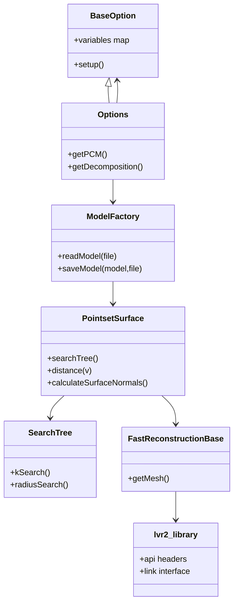

# Architecture / Data Flow

## High-level architecture
- **Build layer**: root `CMakeLists.txt` resolves required deps, then optional feature deps, then composes `src/liblvr2` and selected tool targets.
- **Core library**: `src/liblvr2/CMakeLists.txt` builds `lvr2core` object + `lvr2_static` + `lvr2` (+ CUDA variants when `CUDA_FOUND`).
- **Tool layer**: executables in `src/tools/*/CMakeLists.txt` mostly link to static core libs (`lvr2_static`), e.g. `src/tools/lvr2_reconstruct/CMakeLists.txt`.
- **Install/config layer**: root install writes headers + exported targets + package configs (`CMakeModules/*.cmake.in`, `CMakeModules/lvr2-packaging.cmake`).

## Runtime flow (`lvr2_reconstruct`)
Main reconstruction path (`src/tools/lvr2_reconstruct/Main.cpp`):
1. Parse CLI (`reconstruct::Options`) from `BaseOption`.
2. Load model through `ModelFactory::readModel` (`include/lvr2/io/ModelFactory.hpp` + `src/liblvr2/io/ModelFactory.cpp`).
3. Build surface model (`PointsetSurface`) and neighbor structure (`SearchTree`).
4. Build grid + reconstruction (`GridBase`, `FastReconstructionBase`).
5. Optional texture/material pipeline (`Materializer`, texturizers).
6. Optimize mesh + persistence via `ModelFactory::saveModel`.

```mermaid
sequenceDiagram
    autonumber
    participant CLI as CLI invocation
    participant Opt as reconstruct::Options (BaseOption)
    participant MF as ModelFactory
    participant Surf as PointsetSurface/SearchTree
    participant Reco as FastReconstruction
    participant Mesh as MeshBuffer/Optimizer
    participant Out as Output ModelFactory

    CLI->>Opt: parse argv / --inputFile
    Opt->>MF: getInputFileName()
    MF->>MF: readModel(path)
    MF-->>Surf: create point-surface abstraction
    Surf-->>Reco: build grid + reconstruction
    Reco->>Mesh: mesh output
    Mesh->>Mesh: optimize/cluster/clean
    Mesh->>Out: saveModel(path)
    Out-->>CLI: status / saved artifacts
```

## Data/Component view



## Build-time dependency flow

```mermaid
flowchart LR
    A[Root options\nCMakeLists.txt:5-15] --> B[Required deps\nCMakeLists.txt:134-240]
    B --> C[Core build\nsrc/liblvr2/CMakeLists.txt]
    C --> D[Tool targets\nadd_subdirectory(src/tools/...)]
    D --> E[Export/install\nCMakePackageConfigHelpers]
    E --> F[Consumer: find_package(lvr2)]
```

## What can be removed cleanly
- **Display/OpenGL code remains in core** (`include/lvr2/display/*` + `src/liblvr2` always includes display sources) so it cannot be headless-optimized without a module split (`src/liblvr2/CMakeLists.txt`).
- **Tool branches** (`Freenect`, `3DTiles`, CUDA/OpenCL, viewer) are mostly additive and can be detached behind explicit build profiles.
- **Legacy/redundant modules** (e.g., `ext/kintinuous`, orphan tool dirs, old docs/scripts) are not referenced in default user path and are likely first-class strip candidates.

## Source anchors used
- `src/tools/lvr2_reconstruct/Main.cpp`
- `src/tools/lvr2_reconstruct/Options.cpp` / `src/tools/lvr2_reconstruct/Options.hpp`
- `src/liblvr2/io/ModelFactory.cpp` / `include/lvr2/io/ModelFactory.hpp`
- `include/lvr2/reconstruction/PointsetSurface.hpp`
- `include/lvr2/reconstruction/SearchTree.hpp`
- `include/lvr2/reconstruction/FastReconstruction.hpp`
- `src/liblvr2/CMakeLists.txt`
- `CMakeLists.txt`
- `CMakeModules/lvr2-config.cmake.in`

## Deep references
- `docs/analysis-input/architecture-recon.md`
- `docs/analysis-input/dependencies-recon.md`
