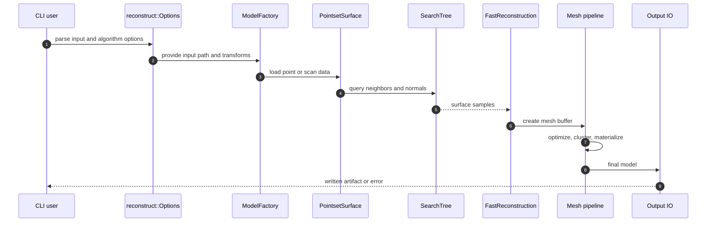
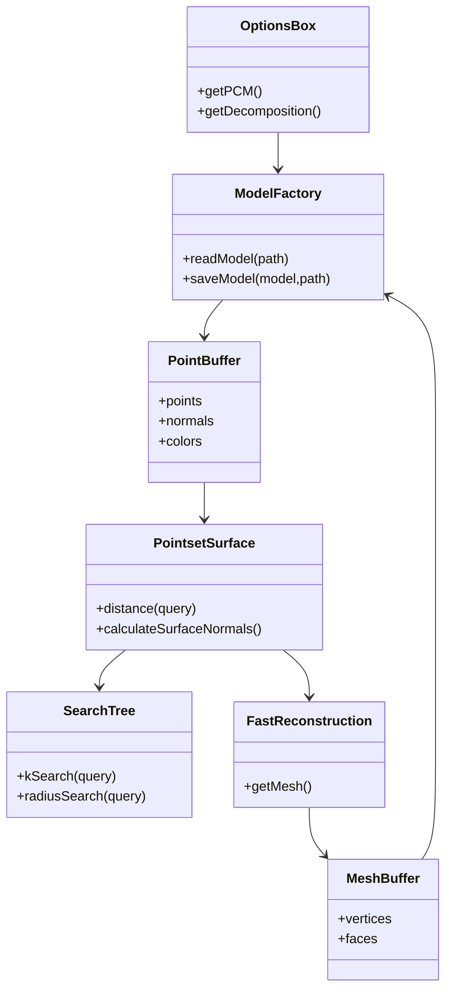
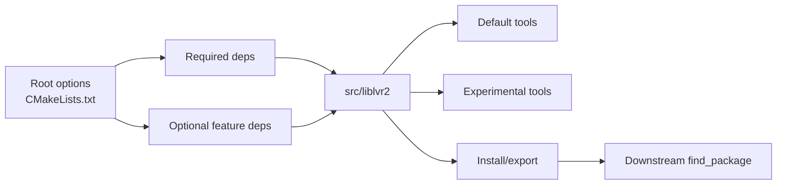

# Architecture / Data Flow

> [!NOTE]
> This page identifies the path to protect while simplifying the repo: **CLI →
> model IO → point surface/search → reconstruction → mesh/output**. Strip work
> should avoid destabilizing this path.

## Runtime pipeline

| Step | Main files | Notes |
|---|---|---|
| Parse CLI | [`Options.cpp`](../src/tools/lvr2_reconstruct/Options.cpp), [`BaseOption.hpp`](../include/lvr2/config/BaseOption.hpp) | Reconstruction behavior is option-driven. |
| Load model | [`ModelFactory.hpp`](../include/lvr2/io/ModelFactory.hpp), [`ModelFactory.cpp`](../src/liblvr2/io/ModelFactory.cpp) | Extension-based IO dispatch. |
| Build surface/search | [`PointsetSurface.hpp`](../include/lvr2/reconstruction/PointsetSurface.hpp), [`SearchTree.hpp`](../include/lvr2/reconstruction/SearchTree.hpp), [`SearchTreeFlann.hpp`](../include/lvr2/reconstruction/SearchTreeFlann.hpp) | Search backend is a natural seam. |
| Reconstruct | [`Main.cpp`](../src/tools/lvr2_reconstruct/Main.cpp), [`FastReconstruction.hpp`](../include/lvr2/reconstruction/FastReconstruction.hpp) | Main product path to preserve. |
| Save output | [`ModelFactory.cpp`](../src/liblvr2/io/ModelFactory.cpp) | Same factory owns output dispatch. |

## Component seams

Use these seams for simplification:

- **Search backends**: keep the interface, reduce default backend/dependency spread.
- **IO formats**: make unsupported formats feature-gated rather than advertised by default.
- **Mesh post-processing**: keep it behind the default reconstruction path; avoid coupling it to viewer/GPU-only code.

## Build topology

| Build area | File links | Simplification seam |
|---|---|---|
| Root options | [options](../CMakeLists.txt#L5-L15) | Decide default product shape here. |
| Dependency probes | [required deps](../CMakeLists.txt#L134-L258), [optional deps](../CMakeLists.txt#L270-L582) | Keep feature deps behind feature flags. |
| Core lib | [`src/liblvr2/CMakeLists.txt`](../src/liblvr2/CMakeLists.txt) | Split display/GPU/legacy IO from headless core. |
| Tools | [tool block](../CMakeLists.txt#L767-L811), [`src/tools`](../src/tools) | Keep default tools small; quarantine experimental tools. |
| Export/install | [`lvr2-config.cmake.in`](../CMakeModules/lvr2-config.cmake.in), [CPack](../CMakeModules/lvr2-packaging.cmake) | Export only the retained public contract. |

## What can be detached first

- Viewer/display code from headless core (`include/lvr2/display`, display sources
  in [`src/liblvr2/CMakeLists.txt`](../src/liblvr2/CMakeLists.txt)).
- GPU-specific tools and CUDA/OpenCL libraries from default builds.
- 3D Tiles, Freenect, KinFu, and orphan tools from the maintained product path.
- Legacy package/docs surfaces after the default build contract is named.

Raw detail: [architecture recon](analysis-input/architecture-recon.md).
