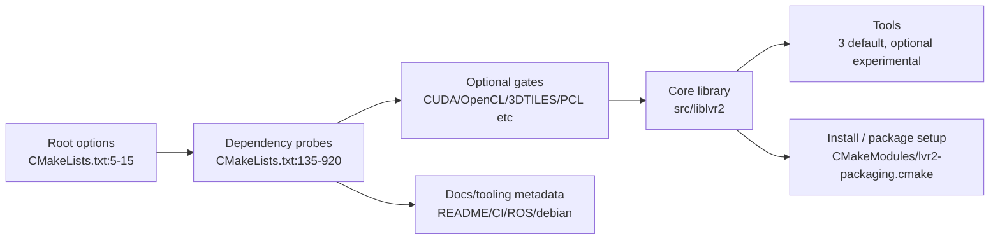

# Current State

## Repo state (as of static scan)
- Versioned in `CMakeLists.txt:2` and `package.xml:4` as **25.2.3**.
- Default build graph in `CMakeLists.txt:767-811` builds:
  - core library (`src/liblvr2`)
  - executables `lvr2_reconstruct`, `lvr2_mesh_reducer`, `lvr2_hdf5_mesh_tool`.
- Defaults intentionally leave `LVR2_BUILD_EXAMPLES` and `LVR2_BUILD_VIEWER` OFF (`CMakeLists.txt:5-7`).
- CUDA/OpenCL features are globally defaulted ON (`CMakeLists.txt:11-12`) and can still pull extra build surface when toolchain matches.

## Module inventory

### Core library
`src/liblvr2/` is modular and built as both static + shared library:
- `algorithm`, `config`, `display`, `geometry`, `io`, `reconstruction`, `registration`, `texture`, `types`, `util`.
- Source list and extra feature branches are assembled in `src/liblvr2/CMakeLists.txt:1-216`.
- Two public libraries exported: `lvr2` and `lvr2_static`, plus CUDA variants `lvr2cuda`/`lvr2cuda_static` under CUDA path.

### Tools
`src/tools/` contains **34** CMake-enabled directories (`find src/tools/*/CMakeLists.txt`).
- Built by default (`LVR2_BUILD_TOOLS=ON`): **3** (`lvr2_reconstruct`, `lvr2_mesh_reducer`, `lvr2_hdf5_mesh_tool`).
- Built under `LVR2_BUILD_TOOLS_EXPERIMENTAL=OFF` by default: **0** in default config.
- In experimental block (`CMakeLists.txt:775-811`) there are 15 root-listed experimental tool dirs; `lvr2_3dtiles` self-gates on old `WITH_3DTILES`, and 3 more dirs are dependency-conditional (`lvr2_cuda_normals`, `lvr2_cl_normals`, `lvr2_cl_sor`).
- Orphans / not reachable from root by default: `lvr2_fastsense_reconstruction`, `lvr2_hdf5_builder`, `lvr2_hdf5_builder_2`, `lvr2_largescale_reconstruct_mpi` and more (`CMakeLists.txt:773-811` comments/absence).

### Vendored and auxiliary modules
- `ext/` vendors: `spdlog`, `spdmon`, `nanoflann`, `psimpl`, `rply`, `laslib`, `HighFive`, `CTPL`, `QVTKOpenGLWidget`, `kintinuous`.
- `CMakeLists.txt:484-523` adds many of these unconditionally.
- External third-party find modules are in `CMakeModules/`.

### External examples/docs/tests footprint
- `examples/` exists but is off by default (`CMakeLists.txt:814-817` plus `examples/CMakeLists.txt`).
- No repository-owned project-wide `enable_testing()` in root; only vendored subprojects configure tests conditionally.

## Build / test / docs / package health

### Build health
- **Stable enough for compile**: CMake still resolves required and many optional deps and emits clear status messages.
- **Risky coupling**:
  - multiple global/legacy CMake patterns (`link_directories`, `include_directories`, global include pollution).
  - variable-name drift (`LVR2_WITH_*` vs `WITH_*`) between root/options and feature code.
  - optional deps and feature targets are not always tied to explicit interface dependencies.

### Test health
- Root CMake does not register tests.
- No CTest invocation in main CI flow (`.github/workflows/cmake-multi-platform-build.yml` ends at build).
- Vendor tests are not a substitute for product coverage.

### Docs health
- Public README docs have stale / inconsistent snippets for package/Ubuntu and CMake examples (`README.md`).
- CLI help/reconstruction docs include placeholder and bug-prone options (`README.md`, `src/tools/lvr2_reconstruct/Options.cpp`).

### Package health
- CPack path is configured (`CMakeModules/lvr2-packaging.cmake`) and installed by default root.
- Legacy Debian packaging path remains in `debian/` and diverges from both CMake options and current dependency surface (`debian/rules`, `debian/control`).
- ROS metadata (`package.xml`) is another contract source and is currently out-of-sync with optional drift (`CMakeLists.txt` vs `package.xml`).

## Current-state flow (build-time)

## Immediate red flags
1. **No first-party test gate** in CI/build path.
2. **Feature flag mismatches** (`LVR2_WITH_*` vs `WITH_*`) around 3DTiles/Freenect/legacy paths.
3. **Docs drift** across `README`, `package.xml`, `CMakeModules/lvr2-packaging.cmake`, and `debian/*`.
4. **Too many dormant product branches** (commented tools, optional subsystems, old scripts) without a maintained status.

## Deeper source refs
- `docs/analysis-input/health-recon.md`
- `docs/analysis-input/architecture-recon.md`
- `docs/analysis-input/dependencies-recon.md`
- `docs/analysis-input/simplification-recon.md`
