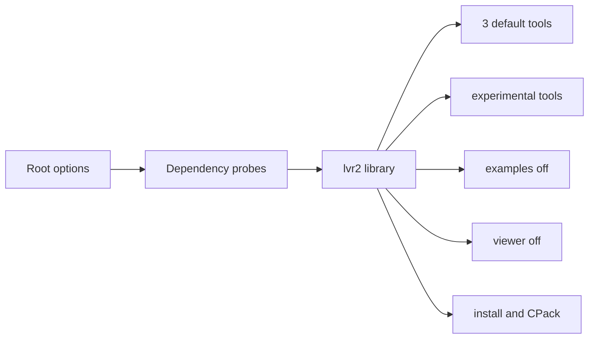

# Current State

> [!NOTE]
> This page answers: **what is shipped by default, what is present but optional,
> and what is not currently proven by CI?** It follows the main thread from
> [the docs entry point](README.md#the-analysis-thread).

## Product surface

| Layer | Current state | Evidence |
|---|---|---|
| Version | Project and ROS package both report `25.2.3`. | [`CMakeLists.txt`](../CMakeLists.txt#L1-L2), [`package.xml`](../package.xml#L1-L5) |
| Default options | Tools on; examples/viewer/KinFu/3D Tiles/PCL/Freenect off; CUDA/OpenCL on. | [root options](../CMakeLists.txt#L5-L15) |
| Default tools | `lvr2_reconstruct`, `lvr2_mesh_reducer`, `lvr2_hdf5_mesh_tool`. | [tool block](../CMakeLists.txt#L767-L771) |
| Experimental tools | Extra tools are behind `LVR2_BUILD_TOOLS_EXPERIMENTAL`; some self-gate or depend on CUDA/OpenCL. | [experimental block](../CMakeLists.txt#L773-L811) |
| Examples | Present but default-off. | [examples gate](../CMakeLists.txt#L814-L817), [`examples/CMakeLists.txt`](../examples/CMakeLists.txt) |
| Viewer | Present but default-off; pulls Qt/VTK/Curses/OpenGL surface when enabled. | [viewer gate](../CMakeLists.txt#L821-L848) |
| Library artifacts | Static and shared variants are built/installed. | [`src/liblvr2/CMakeLists.txt`](../src/liblvr2/CMakeLists.txt#L208-L302) |

## Health pulse

| Signal | Status | Why it matters | Evidence |
|---|---:|---|---|
| Version alignment | ✅ | Release metadata is coherent. | [`CMakeLists.txt`](../CMakeLists.txt#L1-L2), [`package.xml`](../package.xml#L1-L5), [`CHANGELOG.rst`](../CHANGELOG.rst#L1-L8) |
| Default compile path | ⚠️ | CI builds, but broad deps and default GPU probes keep the baseline heavy. | [root options](../CMakeLists.txt#L5-L15), [CI build step](../.github/workflows/cmake-multi-platform-build.yml#L60-L72) |
| First-party tests | ❌ | No root `enable_testing()`/`add_test()` means CI compile success is the main guard. | [CI workflow](../.github/workflows/cmake-multi-platform-build.yml#L60-L72) |
| Docs freshness | ⚠️ | README/package snippets diverge from CI and packaging metadata. | [`README.md`](../README.md), [`debian/control`](../debian/control#L4-L11) |
| Packaging source | ⚠️ | CPack and legacy `debian/` both exist and disagree. | [CPack config](../CMakeModules/lvr2-packaging.cmake#L35-L60), [Debian rules](../debian/rules#L22-L27) |

## Current tension

The repository already has feature-shaped CMake options, but several surfaces are
not cleanly separated yet:

- **Headless core is not truly headless**: display/OpenGL headers and sources are
  still part of the core library surface.
- **GPU is optional but default-on**: `LVR2_WITH_CUDA` and `LVR2_WITH_OPENCL` are
  enabled by default in [root options](../CMakeLists.txt#L11-L12).
- **Feature flags drift**: root uses `LVR2_WITH_*`, while some feature code still
  checks old `WITH_*` variables.
- **Unsupported-looking branches stay visible**: KinFu, Freenect, 3D Tiles,
  commented tools, old scripts, and legacy packaging remain in the active tree.

## What to read next

- To understand why dependencies feel heavy: [Dependency analysis](dependencies.md).
- To turn this into PRs: [Simplification plan](simplification.md).
- To preserve the core runtime path while stripping branches: [Architecture](architecture.md).

Raw evidence used

- [Architecture recon](analysis-input/architecture-recon.md)
- [Dependency recon](analysis-input/dependencies-recon.md)
- [Health recon](analysis-input/health-recon.md)
- [Simplification recon](analysis-input/simplification-recon.md)

