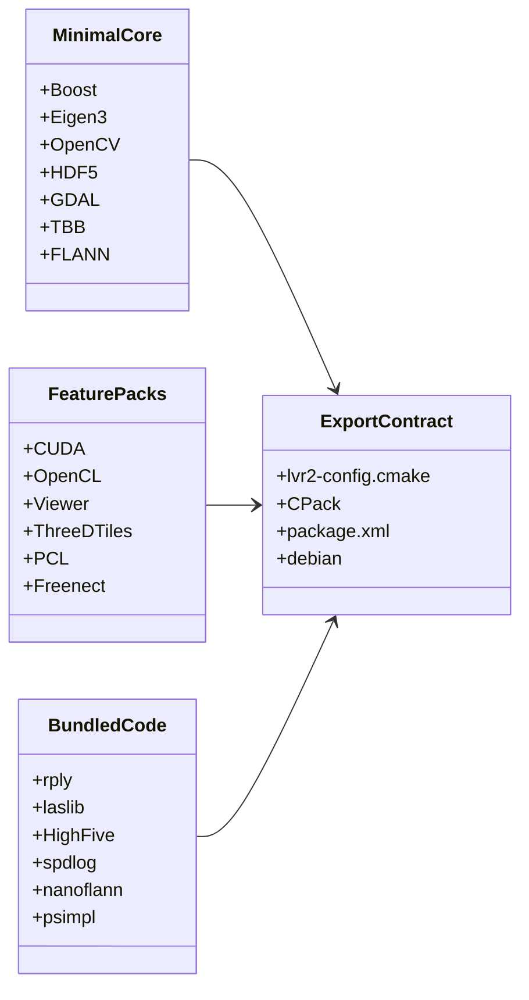

# Dependency Analysis

> [!TIP]
> Read dependencies as a contract problem: **what must a minimal user install,
> what does a feature user opt into, and what does a downstream consumer inherit?**

## Dependency shape

The diagram shows the desired separation. The current tree mixes these layers in
several places, so a minimal build still has to reason about optional and bundled
surfaces.

## Contract risks

| Risk | Impact | Evidence | Suggested direction |
|---|---|---|---|
| CUDA/OpenCL default on | Default builds can become GPU-sensitive when toolchains are present. | [options](../CMakeLists.txt#L11-L12), [CUDA block](../CMakeLists.txt#L270-L338), [OpenCL block](../CMakeLists.txt#L360-L370) | Make GPU explicit opt-in or document the supported default GPU profile. |
| Optional export drift | Consumers can be asked to find deps not required for their build. | [`lvr2-config.cmake.in`](../CMakeModules/lvr2-config.cmake.in#L45-L96) | Export only enabled public features and required find modules. |
| Feature flag name drift | Features can silently fail to compile or link. | [root options](../CMakeLists.txt#L5-L15), [feature source gates](../src/liblvr2/CMakeLists.txt#L130-L211) | Normalize on `LVR2_WITH_*`; add compatibility warnings for old names. |
| Vendored provenance | License/CVE tracking is spread across in-tree copies. | [`ext/`](../ext), [vendored add_subdirs](../CMakeLists.txt#L484-L523) | Introduce `LVR2_USE_BUNDLED_*` policy and license notes. |
| Network build path | 3D Tiles can fetch Cesium Native during build. | [3D Tiles block](../CMakeLists.txt#L540-L571) | Require explicit local/system dependency path or archive feature. |

## Required vs optional vs bundled

Hard or near-hard build gates

| Dependency | Current role | Evidence |
|---|---|---|
| C++17 / CMake | Baseline toolchain. | [`CMakeLists.txt`](../CMakeLists.txt#L1-L18) |
| TBB, TIFF, GDAL | Required root finds. | [required deps](../CMakeLists.txt#L134-L148) |
| OpenCV | Required components: core, imgproc, imgcodecs, features2d, calib3d. | [OpenCV block](../CMakeLists.txt#L154-L164) |
| FLANN, LZ4, GSL, Eigen3 | Required root finds. | [find blocks](../CMakeLists.txt#L173-L194) |
| Boost | Required with several components; MPI can add Boost.MPI. | [Boost block](../CMakeLists.txt#L203-L217) |
| HDF5 | Required C/CXX/HL. | [HDF5 block](../CMakeLists.txt#L227-L230) |
| OpenGL / GLUT | Pulled into core/display surface. | [OpenGL/GLUT block](../CMakeLists.txt#L234-L258), [`Renderable.hpp`](../include/lvr2/display/Renderable.hpp#L45-L49) |
| yaml-cpp | Required later in root CMake. | [yaml-cpp find](../CMakeLists.txt#L518) |

Optional feature packs

| Feature | Dependency surface | Evidence | Simplification note |
|---|---|---|---|
| CUDA | CUDAToolkit/FindCUDA, NVRTC, CUDA targets. | [CUDA probe](../CMakeLists.txt#L270-L338), [CUDA library block](../src/liblvr2/CMakeLists.txt#L308-L392) | Default-off unless GPU is part of supported core. |
| OpenCL | OpenCL finder and OpenCL tools. | [OpenCL probe](../CMakeLists.txt#L360-L370), [tool gates](../CMakeLists.txt#L806-L808) | Default-off; keep explicit CI if retained. |
| Viewer | VTK, Qt5, QVTK, Curses. | [viewer gate](../CMakeLists.txt#L821-L848) | Keep separate from headless core. |
| 3D Tiles | Cesium Native, Draco, feature-specific tool/source gates. | [3D Tiles block](../CMakeLists.txt#L540-L571), [tool CMake](../src/tools/lvr2_3dtiles/CMakeLists.txt) | Quarantine until flag/link wiring is fixed. |
| PCL/RDB/RiVLib/Freenect | Sensor/vendor-specific extensions. | [PCL block](../CMakeLists.txt#L428-L447), [Freenect block](../CMakeLists.txt#L470-L477) | Retain only with owners and smoke tests. |

Bundled code in <code>ext/</code>

| Path | Role | Concern |
|---|---|---|
| [`ext/spdlog`](../ext/spdlog), [`ext/spdmon`](../ext/spdmon) | Logging/progress helpers. | Could be system packages or explicit bundled policy. |
| [`ext/rply`](../ext/rply), [`ext/laslib`](../ext/laslib) | PLY/LAS IO support. | License and static/shared packaging decisions matter. |
| [`ext/HighFive`](../ext/HighFive) | HDF5 C++ headers. | Manually included/installed rather than normal subdir. |
| [`ext/nanoflann`](../ext/nanoflann), [`ext/psimpl`](../ext/psimpl), [`ext/CTPL`](../ext/CTPL) | Header-only helpers. | Low build cost but still provenance surface. |
| [`ext/kintinuous`](../ext/kintinuous) | Legacy KinFu tree. | Strong strip/archive candidate. |

## Metadata drift

| Contract file | What it says | Drift signal |
|---|---|---|
| [README install docs](../README.md) | User-facing dependency list. | Mentions stale package names in the raw recon. |
| [CPack config](../CMakeModules/lvr2-packaging.cmake#L35-L60) | TGZ/DEB dependency output. | Has its own dependency list. |
| [ROS package](../package.xml#L34-L51) | ROS/package manager dependencies. | Another independent list. |
| [Legacy Debian control](../debian/control#L4-L11) | Debian build deps. | Old VTK/CUDA assumptions. |
| [Installed CMake config](../CMakeModules/lvr2-config.cmake.in#L45-L96) | Downstream `find_package(lvr2)`. | Re-finds broad dependencies. |

## Dependency cleanup sequence

1. Define the supported default: headless core + three default tools.
2. Move GPU/viewer/3D Tiles/sensor stacks into explicit feature packs.
3. Add `LVR2_USE_BUNDLED_*` decisions for every vendored dependency.
4. Generate or document package dependencies from the same contract.
5. Test install/export with a tiny downstream `find_package(lvr2 REQUIRED)` project.

Raw detail: [dependency recon](analysis-input/dependencies-recon.md).
