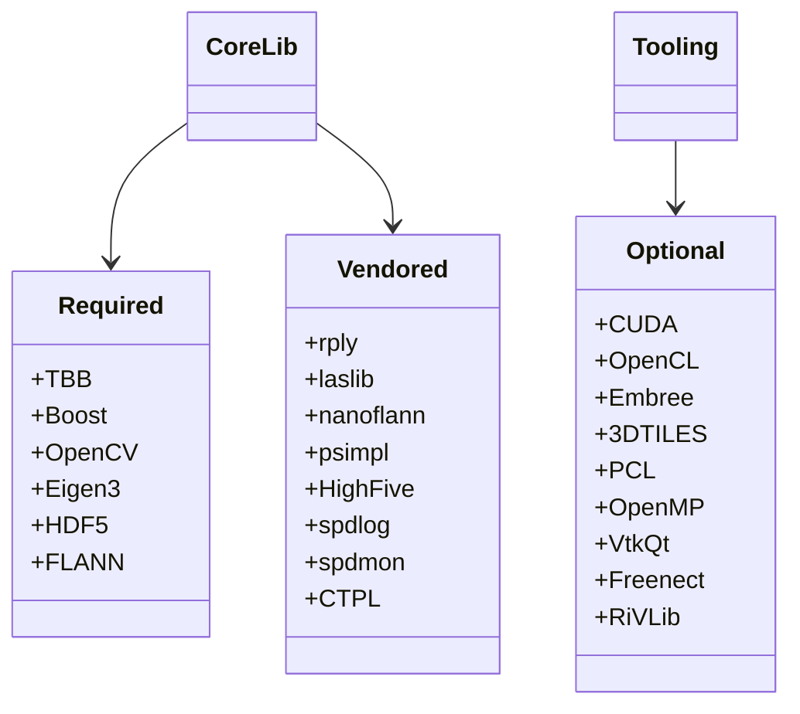

# Dependency Analysis

## Required deps (current hard gates)
In root `CMakeLists.txt` these are hard or near-hard gates for a regular build (`CMakeLists.txt:134-258`, `CMakeLists.txt:518`):
- **Core libs**: `TBB`, `TIFF`, `GDAL`, `OpenCV` (3.x or 4.x components), `FLANN`, `LZ4`, `GSL`, `Eigen3`, `Boost`, `HDF5`, `yaml-cpp`.
- **Graphics/runtime interface**: `OpenGL` is probed and public headers use GL; `GLUT`/`freeglut` becomes required through the fallback path (`CMakeLists.txt:234-258`).
- **Toolchain/config**: C++17 compiler; MPI is probed and then affects Boost component selection if found.
- **Link surface**: `src/liblvr2/CMakeLists.txt:120-230` adds shared/static link lists consumed by both core libs and tools.

## Optional deps (feature gates)
Configured through options in `CMakeLists.txt:11-15` and later blocks:
- `MPI` (opt-in root `find_package(MPI)`; then `Boost mpi` if found).
- `Embree` for raycasting + legacy ASCII viewer support.
- `CUDA`/`OpenCL` (defaults ON): both can add build surface and tool targets (`lvr2cuda*`, `lvr2_cl_*`).
- `PCL` only when `LVR2_WITH_PCL=ON` and MPI resolves.
- `OpenCV non-free` (`LVR2_WITH_CV_NONFREE`).
- `RDB`, `RiVLib`, `libfreenect`, `Draco`, `Cesium-native` (3DTiles path), `VTK/Qt/Curses` for viewer.
- `OpenMP` is searched directly and appended when found.

## Vendored deps in `ext/`
- Unconditionally built: `spdlog`, `spdmon`, `nanoflann`, `psimpl`, `rply`, `laslib`, `CTPL` (`CMakeLists.txt:484-523`).
- Manually included (not added as subdir): `HighFive` headers copied into install include tree (`CMakeLists.txt:513-515`, `ext/HighFive/CMakeLists.txt`).
- Viewer helper: `ext/QVTKOpenGLWidget` injected only in viewer path.
- Deprecated/legacy/unstable: `ext/kintinuous` is present but feature-surfaced inconsistently.

## Dependency risk map

## Risks observed (from code)
1. **Unbounded default feature surface**: CUDA/OpenCL are ON by default and can make “default” builds heavy (`CMakeLists.txt:11-12`, `src/tools/lvr2_cuda_normals/CMakeLists.txt`).
2. **Dependency export drift**: `CMakeModules/lvr2-config.cmake.in` calls `find_dependency(MPI)` unconditionally and exports broad module expectations (`CMakeModules/lvr2-config.cmake.in:45-62`).
3. **Name drift in feature flags**: some feature code checks old `WITH_*` variables (`src/liblvr2/CMakeLists.txt:130-157`) while root uses `LVR2_WITH_*`.
4. **Mixed provenance policy**: system package + vendored + manual header install for HighFive increases compliance and CVE-tracking burden.
5. **Network fetch in build graph**: `ExternalProject_Add(cesium-native, GIT_TAG v0.16.0)` for 3DTILES.

## Strip targets / likely cleanup points

| Target | Why strip or gate | Current owner | Suggested action |
|---|---|---|---|
| Headless/OpenGL split | OpenGL/GLUT are effectively part of core API (`include/lvr2/display/Renderable.hpp:47`, `src/liblvr2/CMakeLists.txt`). | `src/liblvr2/CMakeLists.txt` + `include/lvr2/display/*` | Move display classes behind `LVR2_WITH_DISPLAY` or separate `lvr2display`.
| `ext/kintinuous` + `LVR2_WITH_KINFU` | Unsupported/legacy stack (`ext/kintinuous` + OpenNI2 + CUDA 2.x assumptions). | `ext/kintinuous`, `CMakeLists.txt:9,84-87`. | Remove or quarantine behind explicit opt-in and external docs.
| Freenect | Legacy option mismatch (`LVR2_WITH_FREENECT` vs `WITH_FREENECT` usage). | `CMakeLists.txt:14`, `src/liblvr2/CMakeLists.txt:130`. | Decide deprecation/removal or harden probe/source path.
| 3DTiles path | Probe/build wiring mismatch (`3DTILES_FOUND` vs `WITH_3DTILES`) + external fetch. | `CMakeLists.txt:540-571`, `src/liblvr2/CMakeLists.txt:157`, `src/tools/lvr2_3dtiles/CMakeLists.txt`. | Gate behind explicit system/local policy or remove.
| `LVR2_WITH_CUDA/OPENCL` defaults | Defaults ON inflate build matrix risk. | `CMakeLists.txt:11-12`. | Flip to OFF by default and require explicit opt-in.
| HighFive vendoring approach | Manual include/install workaround, tests/offline policy unclear. | `CMakeLists.txt:513-515`, `ext/HighFive/CMakeLists.txt`. | Decide vendoring policy + lock down source/ABI expectations.

## Links for deep recon
- `docs/analysis-input/dependencies-recon.md`
- `docs/analysis-input/simplification-recon.md`
