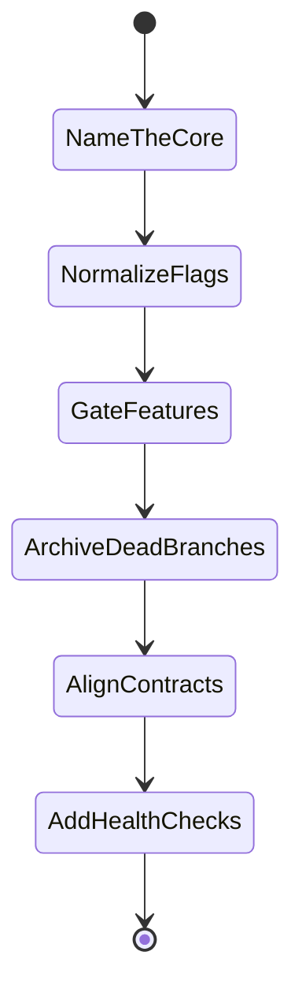

# Simplification Plan

> [!IMPORTANT]
> The plan is not “delete everything old.” It is: **protect the reconstruction
> core, isolate optional features, then remove surfaces that have no owner,
> smoke test, or current dependency story.**

## Roadmap

## PR stack

| Order | PR theme | Outcome | Risk |
|---:|---|---|---|
| 1 | Name the default product | Document “headless core + 3 tools” as the supported baseline. | Low |
| 2 | Normalize feature flags | `LVR2_WITH_*` becomes the only active option namespace. | Medium |
| 3 | Make GPU explicit | CUDA/OpenCL stop surprising default builds, or get a documented default profile. | Medium |
| 4 | Archive dead branches | KinFu, Freenect, orphan/commented tools, and stale scripts leave the active path. | Medium |
| 5 | Split display/viewer | Headless core no longer requires OpenGL/GLUT display API. | Medium/High |
| 6 | Align package contracts | README, CPack, `package.xml`, `debian/`, and export config stop disagreeing. | High |
| 7 | Add proof | CI runs default smoke/CTest and install/export checks. | Low/Medium |

## Strip candidates

| Candidate | Why it fits the thread | Evidence | First safe move |
|---|---|---|---|
| KinFu | Old stack, root option not meaningfully wired into current product. | [`LVR2_WITH_KINFU`](../CMakeLists.txt#L9), [`ext/kintinuous`](../ext/kintinuous) | Move to archive or remove after owner check. |
| Freenect/Kinect | Option/source gates drift; deprecated headers involved. | [Freenect option](../CMakeLists.txt#L14), [probe](../CMakeLists.txt#L470-L477), [source gate](../src/liblvr2/CMakeLists.txt#L130-L133) | Deprecate unless hardware support is confirmed. |
| 3D Tiles path | Feature wiring and dependency fetch policy are unclear. | [3D Tiles block](../CMakeLists.txt#L540-L571), [tool CMake](../src/tools/lvr2_3dtiles/CMakeLists.txt) | Quarantine behind explicit “unsupported/experimental” docs. |
| Commented/orphan tools | They create perceived product surface without default support. | [tool block](../CMakeLists.txt#L773-L811), [`src/tools/`](../src/tools) | Move to an `attic` branch/path or delete after owner check. |
| Legacy Debian path | CPack already exists and `debian/` uses stale options/deps. | [CPack](../CMakeModules/lvr2-packaging.cmake#L35-L60), [Debian rules](../debian/rules#L22-L27) | Pick CPack or regenerate Debian metadata. |
| Stale local scripts | One-off/hardcoded environments look like maintained entry points. | [`Singularity.def`](../Singularity.def), [`spack_modules.bash`](../spack_modules.bash), [`eval.sh`](../eval.sh) | Move to unsupported archive or delete. |

## Keep before cutting

- Preserve [`lvr2_reconstruct`](../src/tools/lvr2_reconstruct) as the flagship
  runtime path.
- Preserve public headers under [`include/lvr2`](../include/lvr2) until the next
  major/API cleanup plan exists.
- Preserve IO formats that are confirmed user-facing contracts; gate them only
  after a migration note exists.

## Gating checklist

Use this checklist before removing a subsystem:

- [ ] Is it reachable from default CMake?
- [ ] Is there an owner or current user?
- [ ] Does CI build or smoke-test it?
- [ ] Are dependencies available on supported Ubuntu/ROS targets?
- [ ] Is it part of the installed API/export contract?
- [ ] Can it be archived first instead of deleted?

## Suggested first cleanup issue

> Normalize feature flags and mark unsupported feature branches.

Scope:

- Replace internal `WITH_*` checks with `LVR2_WITH_*` equivalents.
- Add compatibility warnings for old names for one release.
- Mark 3D Tiles, Freenect, and KinFu as unsupported unless owners confirm.
- Add one configure-only CI job that toggles retained feature flags.

Why first: it makes later deletion decisions mechanical instead of guesswork.

Raw detail: [simplification recon](analysis-input/simplification-recon.md).
