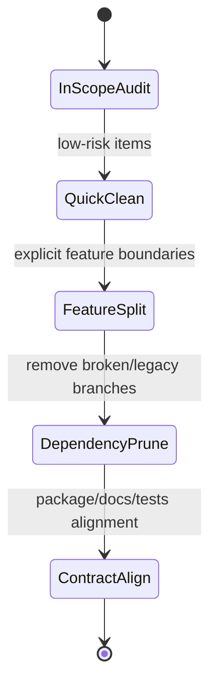

# Simplification Plan

## Goal
Reduce build/runtime footprint without changing project semantics, while keeping a clear path for explicit optional features.

## Prioritized strip / quarantine plan

### T0 (low risk, high clarity)
| Item | Impact | Effort | Risk |
|---|---|---|---|
| Remove/relocate commented tool entries from root (`lvr2_slam2hdf5`, `lvr2_hdf5togeotiff`, `lvr2_registration`, `lvr2_hdf5_convert_old`, `teaser_example`) | Shrinks maintenance surface; clarifies shipped feature set. | Low | Low |
| Move stale scripts from runtime path (`Singularity.def`, `spack_modules.bash`, `eval.sh`) to archived/docs-not-maintained location | Clarifies build contract. | Low | Low |
| Add CI gate for docs/rendered output sanity + package artifacts check (fail-fast) | Improves detectability of regressions. | Medium | Low |

### T1 (medium impact, medium effort)
| Item | Impact | Effort | Risk |
|---|---|---|---|
| Default tools split (`LVR2_BUILD_TOOLS_EXPERIMENTAL` stays OFF) plus explicit feature blocks (GPU/Viewer/3DTiles) | Reduces surprise and compile-time drift. | Medium | Low |
| Fix feature-flag drift (`LVR2_WITH_*` vs `WITH_*`) across `CMakeLists.txt`, `src/liblvr2/CMakeLists.txt`, and `src/tools/lvr2_3dtiles/CMakeLists.txt` | Stabilizes toggles and avoids silent dead paths. | Medium | Medium |
| Remove or explicitly mark legacy `3DTILES` block until contract is settled | Removes broken branch risk from default workflow. | Medium | Medium |
| Clean up `ext/kintinuous` and `LVR2_WITH_KINFU` usage | Removes dead legacy dependency chain and old stack assumptions. | Medium | Medium |

### T2 (high impact, higher effort)
| Item | Impact | Effort | Risk |
|---|---|---|---|
| Split display/OpenGL from headless core (`src/liblvr2/display/*`) | Enables true headless default with smaller dependency requirements. | High | Medium |
| Rework vendored policy (LZ4, nanoflann, psimpl, rply, laslib, spdlog/HighFive) into explicit `LVR2_USE_BUNDLED_*` toggles | Simplifies security/compliance and reproducibility. | High | Medium |
| Replace legacy static/shared duplication (`lvr2`, `lvr2_static`, `lvr2cuda`, `lvr2cuda_static`, rply/laslib both modes) with build-option control | Shrinks artifact fan-out and packaging complexity. | Medium/High | Low |
| Consolidate package metadata source of truth (CPack vs `debian/` vs ROS `package.xml`) | Removes packaging surprise and CI confusion. | High | High |

## What should be preserved first (non-strip)
- `lvr2_reconstruct` core flow and options baseline.
- Public library headers under `include/lvr2` currently used by downstream.
- Required core deps that are used by all builds (Boost/Eigen/HDF5/OpenCV/GDAL/etc.).

## Simplification decision matrix

## Concrete strip candidates (current)
- `ext/kintinuous`, `LVR2_WITH_KINFU`, `src/liblvr2` Freenect branch.
- `lvr2_fastsense_reconstruction`, `lvr2_hdf5_builder`, `lvr2_hdf5_builder_2`, `lvr2_largescale_reconstruct_mpi` and other unreferenced/experimental tool bins.
- `LVR2_WITH_3DTILES` path unless offline/provisioned policy is established.
- `Singularity.def`, `spack_modules.bash`, `eval.sh` from active project surface.

## Why this ordering
- Starts with low-effort clarity moves (tooling/docs), then isolates feature boundaries (so no implicit build creep), then removes true risk-heavy legacy branches.

## Deep refs
- Detailed findings: `docs/analysis-input/simplification-recon.md`
- Option/config evidence: `docs/analysis-input/dependencies-recon.md`, `docs/analysis-input/architecture-recon.md`
